# Editor-Imagini

Demo: https://acovalcic.github.io/Editor-Imagini/

 Aplicatie ce aplica diverse filtre pe o imagine. Aplicatia permite modificarea pixelilor unei imagini pentru a crea anumite filtre ce se vor aplica acesteia precum: sepia, tonuri de gri, inversarea culorilor si altele. Imaginea rezultata va putea fi descarcata.

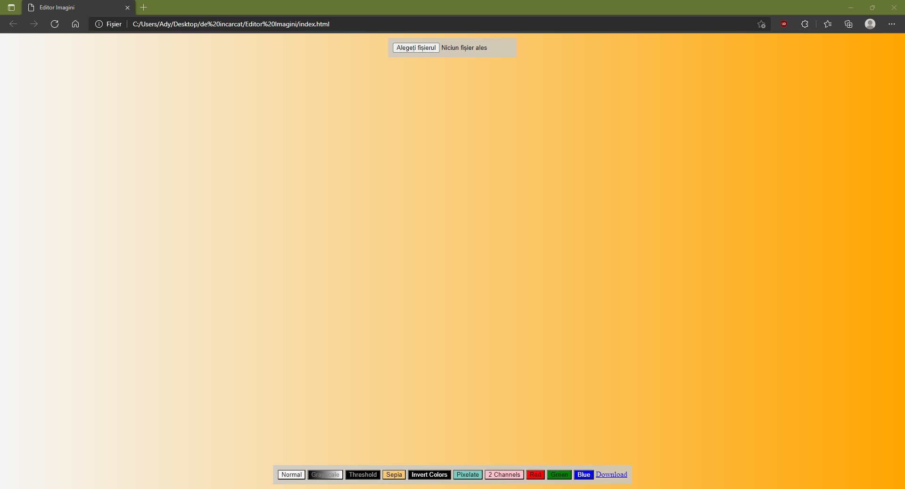

Apasarea butonului *Alegeti fisierul* va deschide o fereastra de dialog ce va permite incarcarea unei imagini.

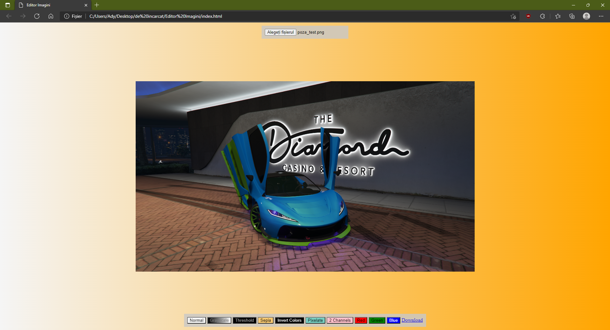

Imaginea incarcata va aparea fara niciun filtru aplicat, corespunzator efectului *Normal*. Daca se va apasa pe butonul de *Download* imaginea rezultata va arata astfel:

## Grayscale

La apasarea butonului *Grayscale* imaginea va deveni una in tonuri de gri:

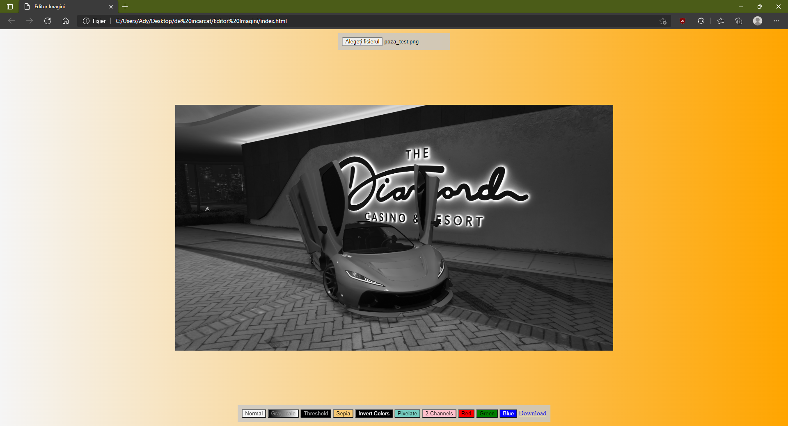

Imaginea descarcata va arata astfel:

## Threshold

Functia *Threshold* va transforma imaginea in una alb-negru:

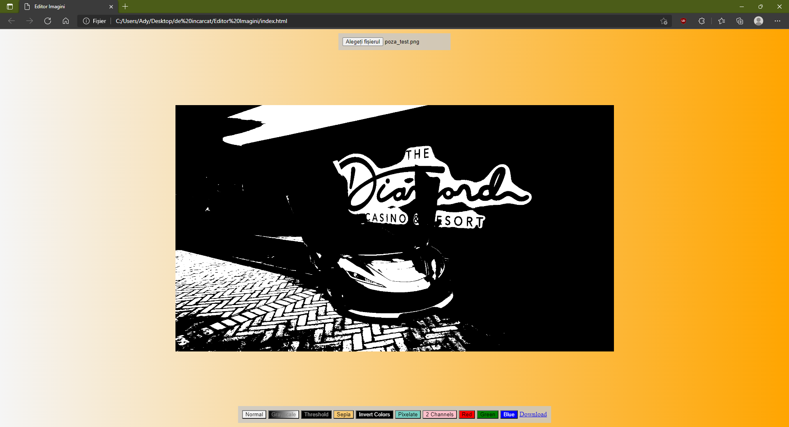

Dupa descarcare, imaginea va arata astfel:

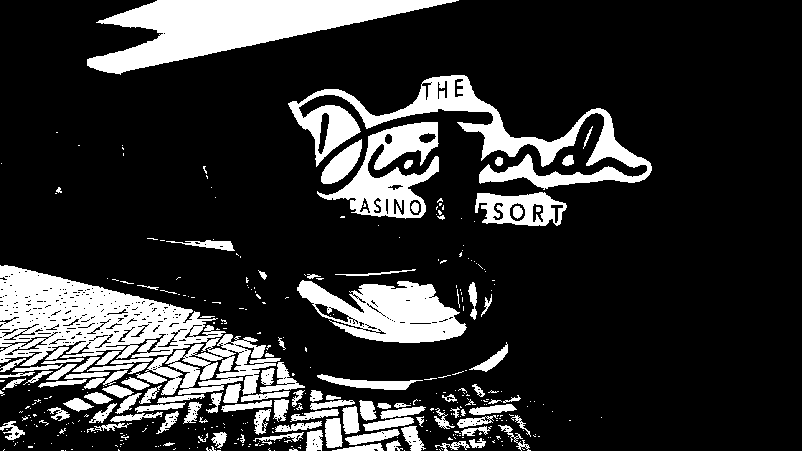

## Sepia

Butonul *Sepia* va face imaginea sa semene cu o poza veche de la inceputul secolului trecut:

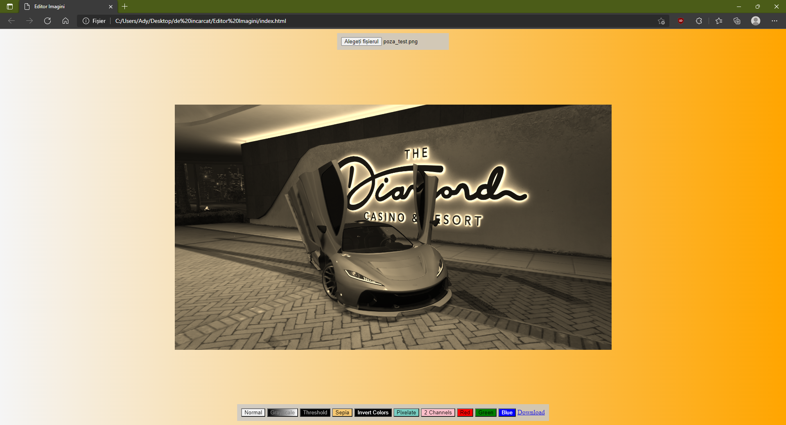

Imaginea salvata arata astfel:

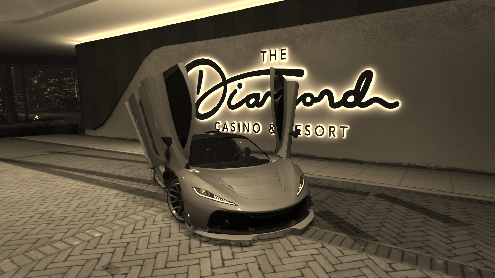

## Invert Colors

Functia de *Inversare a culorii* va face ca fiecare pixel sa si inverseze culoarea, rezultatul fiind inversarea culorilor din intreaga imagine:

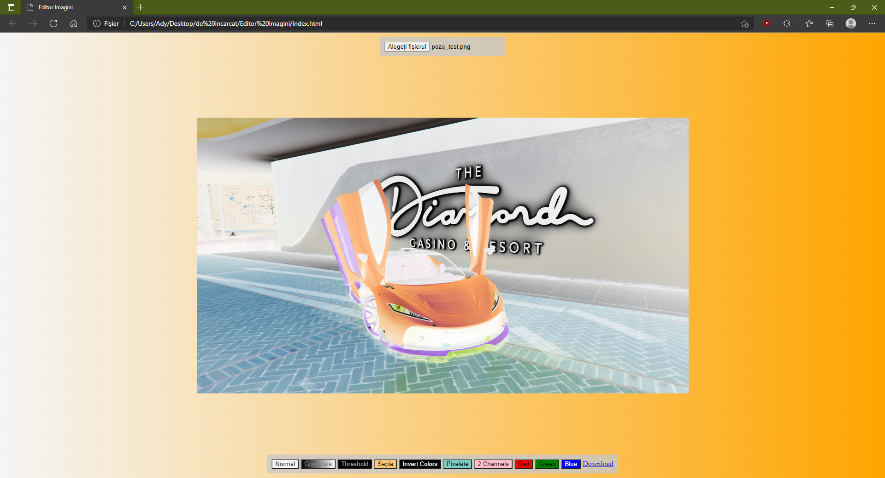

Imaginea descarcata cu culorile inversate:

## Pixelate

Butonul *Pixelate* va face ca pixelii din imagine sa fie vizibili, ca si cand imaginea a fost redimensionata la dimensiuni care sunt prea mari pentru rezolutia sa:

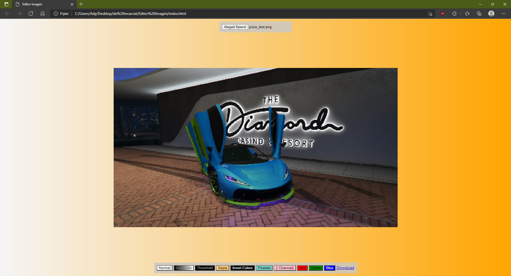

Imaginea *pixelata* dupa descarcare:

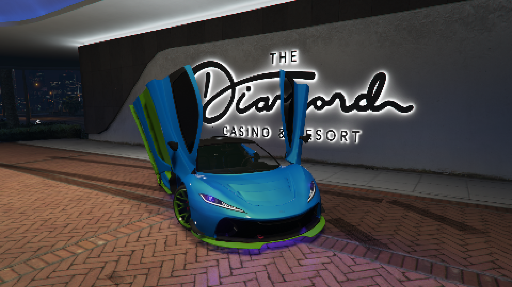

## 2 Channels

Efectul *2 Channels* va transforma imaginea din una de tipul RGB inlocuind canalul albastru cu inca un canal verde, astfel devenind de tipul RG, dupa cum se poate vedea mai jos:

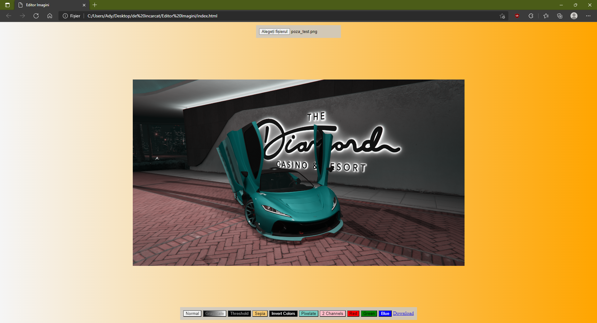

Imaginea in 2 canale descarcata:

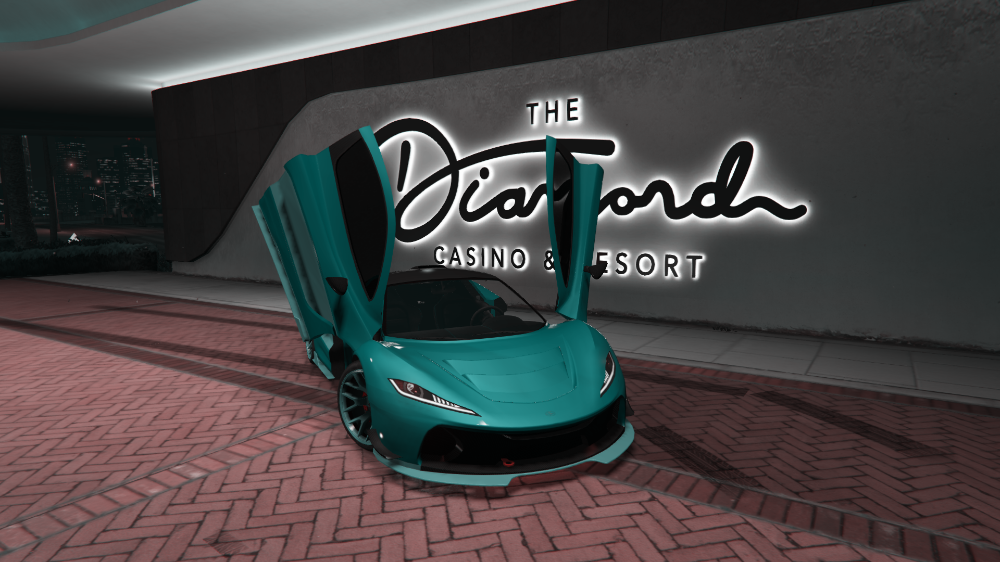

## Red

Functia *Red* va pastra din fiecare pixel al imaginii doar componenta rosie, astfel rezultand o imagine rosie:

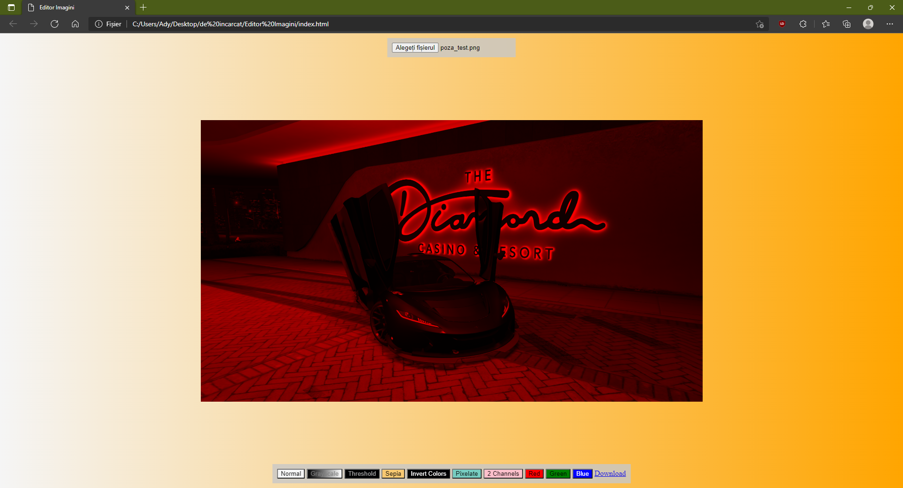

Imaginea rosie descarcata:

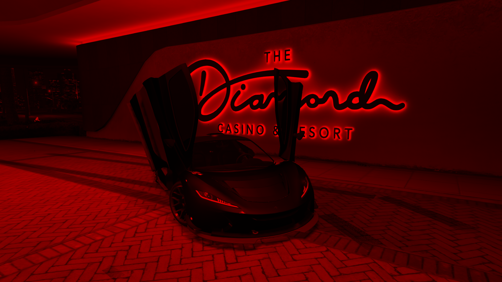

## Green

Butonul *Green* va elimina din fiecare pixel al imaginii componentele rosii si albastre, ramanand doar cea verde, rezultatul fiind o imagine verde:

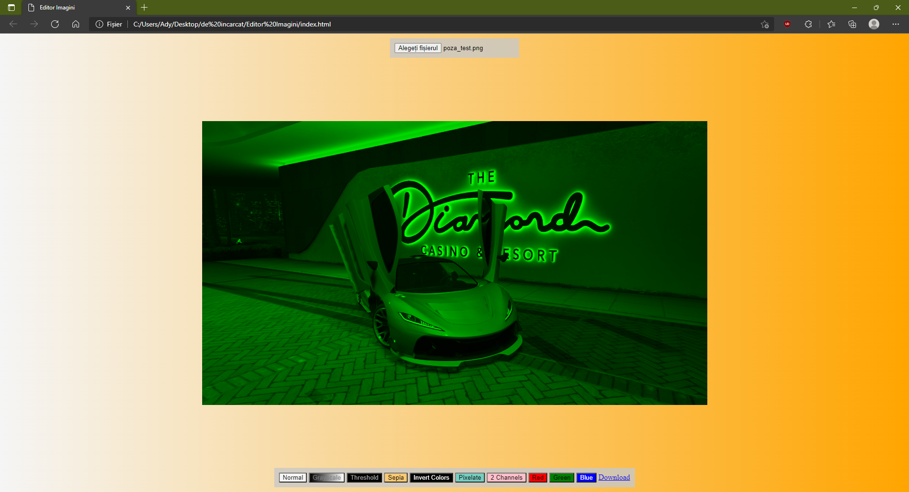

Imaginea verde dupa descarcare:

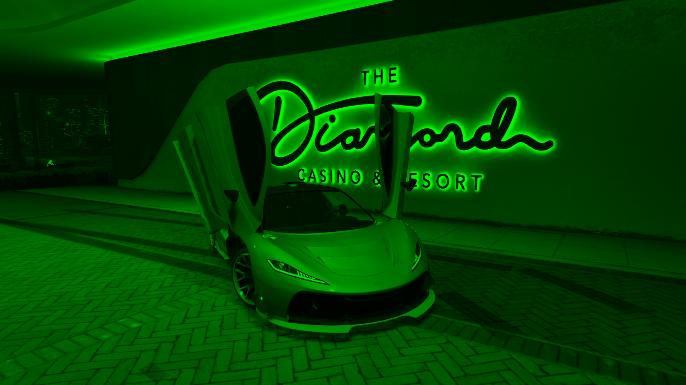

## Blue

Efectul *Blue* va nula componentele rosii si verzi din fiecare pixel al imaginii, rezultatul acestuia fiind o imagine albastra:

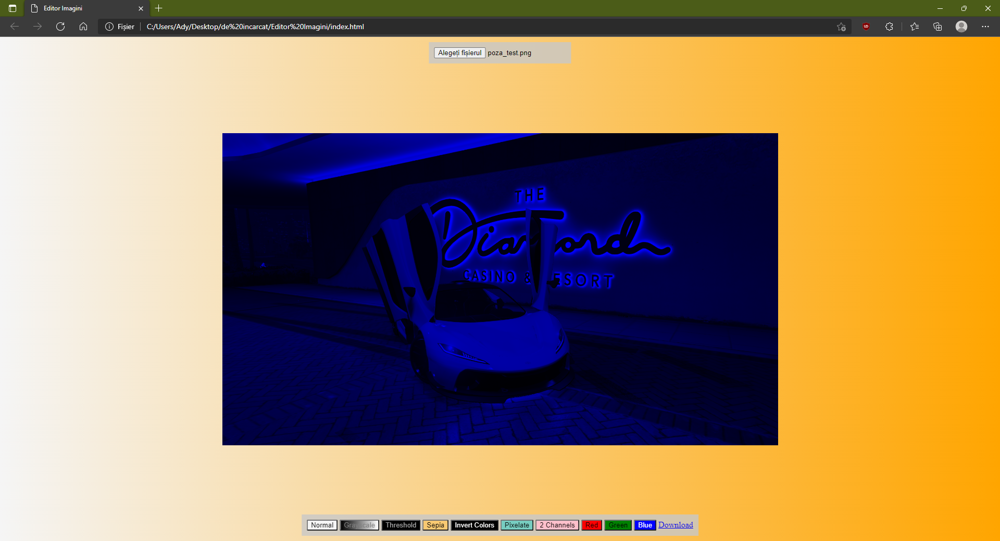

Imaginea albastra descarcata:

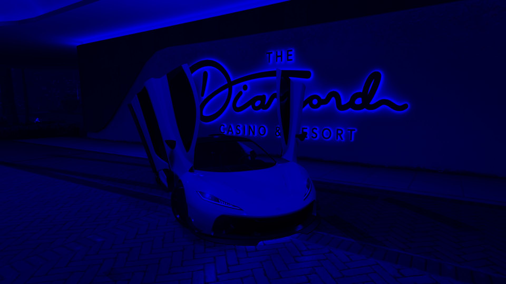
